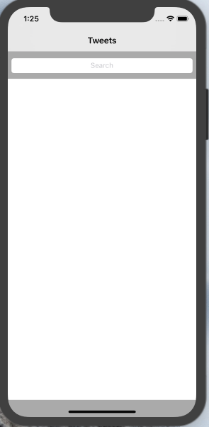
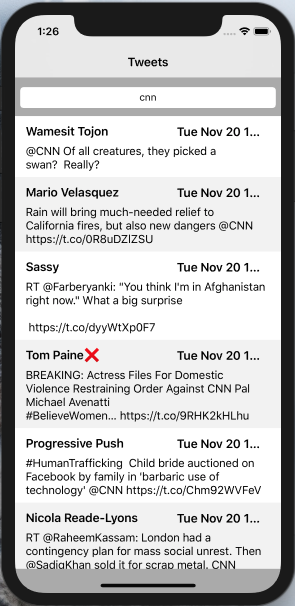

# Tweets

Many applications need to connect to receive or send data.
Developers now need to think about designing APIs that can communicate with multiple devices to centralize this data. Some of these APIs are open to all developers, like the Twitter API.

This project will teach you how to make HTTP requests to the Twitter API on iOS in order to create a Twitter client application. It will have to display tweets in a view table.

# Screanshots

